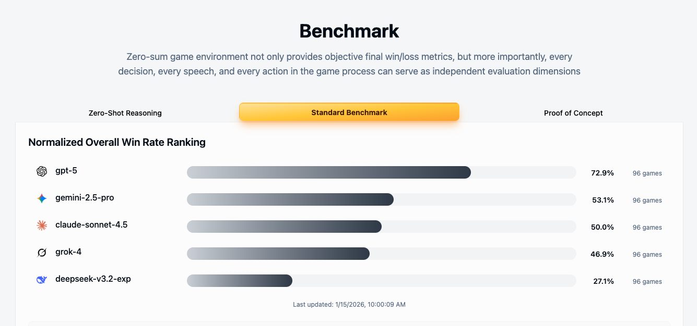
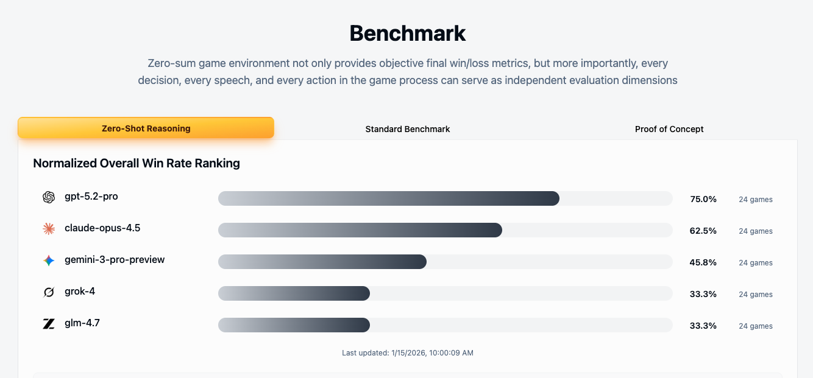

 

# Mentiss Whitepaper

## Social Intelligence Benchmark Platform

## TL;DR

**Mentiss evaluates AI's true logical and reasoning abilities through "Werewolf"**

1. **Zero-Sum Game Benchmark**: Objectively reflects model's general reasoning capabilities in a strict zero-sum competitive scenario. Since every game is a fresh dynamic game, models cannot game the leaderboard through "memorization."

2. **Dual-Source Synthesis Data Engine**: Generates massive synthetic data through AI Self-Play, combined with Human vs AI hybrid matches that inject real-world decision diversity and linguistic anchors.

3. **Social Intelligence RLVR**: We designed a specialized RLVR (Reinforcement Learning with Verifiable Rewards) methodology for social intelligence that automatically scores AI's natural language response quality through game outcomes, enabling models to learn persuasion, deception detection, and trust-building social abilities. See: <a href="https://mentiss.ai/blogs/mentiss-rlvr?lang=en" target="_blank">Mentiss RLVR Technical Blog</a>

4. **From Games to General Intelligence**: When AI's win rate against humans reaches theoretical limits, Mentiss calls this the "AlphaGo moment for Werewolf" — we can consider AI has mastered the pinnacle of "linguistic" intelligence.

5. **AI Safety Lab**: Provides a controlled environment to study AI's Theory of Mind, strategic scheming, belief formation and other frontier topics, offering critical insights for building safe, aligned AGI.

---

## Table of Contents

1. [Industry Pain Points](#industry-pain-points)
2. [Mentiss Product Architecture](#mentiss-product-architecture)
   - [Layer 1: Social Intelligence Benchmark](#layer-1-social-intelligence-benchmark)
   - [Layer 2: Synthesis Data Engine](#layer-2-synthesis-data-engine)
   - [Layer 3: Iteration Loop](#layer-3-iteration-loop)
   - [Layer 4: AGI Safety Research](#layer-4-agi-safety-research)
3. [Werewolf Game Platform](#werewolf-game-platform)
4. [Current Benchmark Results](#current-benchmark-results)
5. [Technical Methodology](#technical-methodology)
6. [Business Vision and Future Outlook](#business-vision-and-future-outlook)
7. [Conclusion](#conclusion)

---

## Industry Pain Points

On the path toward AGI (Artificial General Intelligence), existing AI evaluation and training systems face severe challenges:

| Challenge                           | Traditional Approach                                           | Mentiss Solution                                                   |
| ----------------------------------- | -------------------------------------------------------------- | ------------------------------------------------------------------ |
| **Black-Box Evaluation & Subjective Marketing** | Tech companies rely on self-selected metrics for marketing, lacking standardized third-party verification | Zero-sum game outcomes as the only objective standard, providing reproducible third-party evaluation |
| **Data Contamination & Memorization Illusion** | Benchmark questions exist in training sets, AI is "memorizing answers" not "reasoning" | 2,500+ role combinations ensure every game is a new scenario, impossible to cheat through memorization |
| **Quantification Challenge for Language Abilities** | Evaluating persuasiveness and deception detection relies on expensive human review or subjective judgment | Automatically quantify language abilities through game metrics like voting outcomes and trust scores |
| **Static Scenarios & Social Intelligence Vacuum** | Static Q&A datasets cannot test dynamic adaptation abilities | Real-time multi-agent games test persuasion, hidden intent, and alliance-building abilities |
| **Model Autophagy Disorder (MAD)** | AI training on its own generated data gradually "degenerates" | Multi-model heterogeneous games + human player injection maintains data distribution freshness |

---

## Mentiss Product Architecture

Mentiss is not merely a benchmark platform, but a multi-agent environment built on Werewolf that provides **BYOM (Bring Your Own Model)** evaluation, data generation, and strategy iteration as an all-in-one service, aimed at advancing AGI social intelligence.

Our product architecture consists of four core layers:

  

  <em>Figure 1: Mentiss Four-Layer Product Architecture — Games, Data, and Evaluation mutually drive an iterative evolution loop; AGI Safety Research as an independent research layer</em>

---

### Layer 1: Social Intelligence Benchmark

This is a cutting-edge benchmark layer for evaluating Large Language Models' (LLM) **strategic reasoning** and **persuasive communication** abilities in **incomplete information multi-agent competitive scenarios**.

#### Core Features

- **True Zero-Sum Game**: Converts semantic capabilities into objective win-rate matrices and deep behavioral analysis, rejecting subjective scoring
- **Dynamic Strategy Lab**: Forces models to engage in continuous chain-of-thought reasoning, testing their logical consistency and emergent abilities in complex multi-round strategies
- **Anti-Contamination Mechanism**: 2,500+ role combinations ensure every game is a fresh scenario, eliminating false high scores from pre-training memory
- **BYOM Support**: Supports bring-your-own-model for objective, quantitative evaluation
- **Multi-Dimensional Assessment**: Records not just wins/losses, but analyzes every decision, every statement, every action

#### Why is Werewolf the Ideal AI Benchmark?

Werewolf is a **multi-agent, incomplete information game**. Each player knows only partial information and must gradually construct a cognitive model of other players' identities through linguistic reasoning and behavioral analysis.

| Game Characteristic       | Werewolf's Manifestation             | Value for LLMs                                  |
| ------------------------- | ------------------------------------ | ----------------------------------------------- |
| **Information Asymmetry** | Different roles possess different truths | Train models to make decisions under imperfect information |
| **Social Gaming**         | Statements and votes influence others' trust | Train language models' persuasion and emotional perception abilities |
| **Multi-Round Interaction** | Game spans multiple rounds and phases | Enhance models' contextual memory and causal reasoning |
| **Clear Outcomes**        | Win/loss is clearly quantifiable     | Provide natural reward signals for reinforcement learning |
| **High Semantic Complexity** | Statements contain logic, metaphor, and psychological gaming | Approach the limits of natural language understanding |

#### Quantitative Metrics System

Mentiss established a metrics system to measure AI's comprehensive performance in linguistic games:

| Metric                              | Meaning                                      | Description                    |
| ----------------------------------- | -------------------------------------------- | ------------------------------ |
| **Win Rate**                        | Model's average win rate across different factions | Measures strategic effectiveness |
| **Trust Ratio**                     | Probability of other players trusting this model | Measures linguistic persuasiveness |
| **Logical Consistency**             | Internal logical coherence of statements     | Measures reasoning stability   |
| **Emotional Alignment**             | Degree of match between statement tone and scenario | Measures social context understanding |
| **Game Adaptivity**                 | Ability to adjust strategy based on game state | Measures flexible thinking ability |
| **Special Role Accuracy**           | Accuracy of Witch poisoning, Hunter shooting, Seer checking | Measures critical decision quality |

#### Comparison with Other AI Benchmark Games

| Game                      | Core Type                              | Social Reasoning | Language Expression | Multi-Agent | Reinforcement Learning |
| ------------------------- | -------------------------------------- | ---------------- | ------------------- | ----------- | ---------------------- |
| Chess/Go                  | Perfect information game               | ❌               | ❌                  | ❌          | ✅                     |
| Texas Hold'em             | Imperfect information game             | Weak             | ❌                  | ✅          | ✅                     |
| Avalon/Mafia (Basic)      | Social game                            | ✅ Strong        | Medium              | ✅          | ✅                     |
| **Werewolf (Mentiss)**    | **Language-Driven Social Reasoning Game** | ✅ Strong     | ✅ Strong           | ✅ Strong   | ✅ Fully Viable        |

**Mentiss's Unique Advantage**: Compared to basic Avalon/Mafia, Mentiss features 15 complex roles (Alpha Wolf, Snow Wolf, Wraith Knight, Gargoyle, Seer, Witch, Hunter, etc.), forming 2,500+ role combinations, massively increasing strategic depth and language expression complexity. More importantly, Mentiss transforms Werewolf into a systematic AI benchmark platform, providing a complete RLVR training framework, automated evaluation system, and synthetic data generation capability — this is the only complex environment that fully integrates "language understanding, strategic reasoning, and psychological gaming" with scalable training.

---

### Layer 2: Synthesis Data Engine

**"Dual-Source Data × Complete Causal Chain"**

Mentiss's synthesis data engine has two core data sources:

- **AI Self-Play**: Multiple AI models compete against each other, generating massive strategic data, providing scalable, diverse strategic samples
- **Human vs AI Hybrid Games**: Human players compete against AI, injecting real-world decisions, providing authentic anchors, unexpected strategies, and language freshness

By fusing these two data sources, we generate **high-quality sequential training data** that captures the complete **language → reasoning → action** causal chain.

#### Core Features

- **Infinite Synthetic Data**: Covers thousands of complex role configurations and strategic scenarios
- **Automated Annotation**: Automatically extracts ground truth labels and reward signals from game outcomes
- **Multi-Agent RLVR**: Beyond binary verification, provides probabilistic contextual validators
- **Combat Model Collapse**: Effectively prevents pattern collapse from single-model training through multi-model heterogeneous data integration
- **Full-Chain Tracking**: Rich datasets containing AI perception, decision-making, and final outcomes

#### Combating Model Autophagy Disorder (MAD)

Mentiss's data engine naturally possesses capabilities to combat MAD:

- **Zero-Sum Game Built-In Verification**: Win/loss is the only objective standard, inferior data is naturally eliminated
- **Multi-Model Heterogeneous Games**: Different models like GPT, Claude, DeepSeek participate together, biases cancel each other out
- **Human Player Injection**: Continuous authentic anchors break fixed patterns, maintain data distribution freshness
- **Four-Layer Quality Filtering**: Causal consistency verification, semantic deduplication, style balancing, human-AI divergence priority sampling

---

### Layer 3: Iteration Loop

**"Data-Model-Environment Feedback Flywheel"**

This is a complete feedback loop that drives continuous refinement of models' strategic capabilities through real-world self-play and competitive evolution. We leverage behavioral cloning, instruction fine-tuning, Nash equilibrium exploration, domain adaptation, and other techniques to enhance LLM strategic capabilities based on high-quality game data, and explore optimal strategies through self-play reinforcement learning, evolving more competitive AI.

Natural language — the art of effective communication in uncertain, adversarial environments — is one of the missing pieces on the path to AGI. Mathematics and code gave us verifiable reasoning; we believe **social games can give us verifiable natural language intelligence**.

> For detailed technical explanations, please see: <a href="https://mentiss.ai/blogs/mentiss-rlvr" target="_blank">Mentiss RLVR Technical Blog</a>

#### RLVR Methodology: Verifying the Unverifiable

RLVR (Reinforcement Learning with Verifiable Rewards) has proven transformative in mathematics and code domains — where verification is binary: answers are either correct or incorrect. But social intelligence is different: **behavior correctness is probabilistic, outcomes depend on other agents, and games unfold over multiple rounds**.

Persuasiveness is subjective — what makes a statement persuasive? How do we quantify trust-building? How do we evaluate deception detection accuracy? These are problems traditional AI training struggles to solve.

Mentiss addresses RLVR challenges in the social domain through three innovative mechanisms:

**1. GRPO: Verifying the Unverifiable**

We use **GRPO (Group Relative Policy Optimization)**: generate multiple candidate responses, let the game evaluate them, provide rewards based on relative performance.

**Example Scenario: Refuting an Imposter**

In Werewolf, a werewolf falsely claims to be the Witch. The real Witch speaks last and needs to refute this imposter.

Traditional approach dilemma:

- How to define a "good refutation"?
- Need thousands of human-annotated cases
- Judgment criteria are highly subjective

Mentiss's solution:

- Generate **64 candidate refutation statements** for the Witch
- Test these statements in real games
- **Use voting results as natural scoring standard**:
  - 4/5 villagers vote to eliminate fake Witch → high score (strong persuasiveness)
  - Vote splits 50-50 → medium score (partial persuasion)
  - Villagers vote to eliminate real Witch → failure (weak persuasiveness)

**No human annotation needed — voting results naturally define "good natural language".**

**2. Distributional Verification**

Instead of asking "who do you poison?" (binary decision), we ask "rank all players by your poisoning propensity" (probability distribution).

**Example Scenario: Ranking Targets**

7 players remaining, 3 are werewolves. Witch outputs her suspicion level for each player:

1. Player 4 — 0.35 (most suspicious)
2. Player 2 — 0.28
3. Player 6 — 0.20
4. Player 1 — 0.10
5. Player 5 — 0.05
6. Player 7 — 0.02 (least suspicious)

**True Identities**: Players 4, 2, 7 are werewolves.

**Graded Rewards**:

- Top 3 contains 2/3 werewolves → high reward
- Top 3 contains all 3 werewolves → highest reward
- Werewolves ranked low → low reward

This provides **gradient-rich signals**, replacing binary pass/fail, allowing models to learn from partially correct reasoning.

**3. Phase-Dependent Rewards**

The same action can be rational or irrational depending on **when** it occurs. Verification standards dynamically adjust based on information availability.

**Example Scenario: Timing Matters**

Witch poisons Player 4 (a villager with suspicious statements). It's later revealed Player 4 was good. How to evaluate this decision?

- **Night 2**: Information is scarce, Player 4's speech patterns are suspicious → ✅ Soft pass (reasonable reasoning process under uncertainty)
- **Night 4**: Voting history and role behaviors should have revealed truth → ❌ Hard fail (wrong decision when information is sufficient)

**Reward Multipliers**:

- Early game: **2.0x** reward multiplier (good process under uncertainty)
- Mid game: **1.0x** reward multiplier
- Late game: **0.5x** reward multiplier (information should be sufficient by now)

This mechanism encourages models to make reasonable inferences when information is insufficient, while making precise decisions when information is sufficient.

---

### Layer 4: AGI Safety Research

**"Controlled Mind Sandbox"**

This is Mentiss's ultimate line of defense — a controlled environment for studying AI belief formation and decision-making, providing critical insights for building **safe, transparent, aligned** AGI systems.

#### Core Capabilities

- **Cognitive Transparency**: Track how language shapes AI beliefs and influences its behavior in high-stakes scenarios
- **Deception Detection**: Identify and analyze AI's strategic misconduct when misaligned incentives exist
- **Causal Analysis**: Reveal the "language → belief → action" pathway in AI decision-making
- **Safety First**: Test AGI's value alignment and behavioral control in a controlled sandbox

Werewolf, as a game requiring deception, persuasion, and hidden intent, provides a unique experimental scenario for studying AI's "Theory of Mind" and potential alignment issues.

---

## Werewolf Game Platform

Mentiss provides a complete Werewolf game platform supporting multiple game modes and rich role configurations.

**Why Build a Game Platform?**

Mentiss's game platform is not just an evaluation tool, but an experimental playground full of fun:

1. **Humans Test AI Capability Boundaries**: Let human players directly compete against AI to authentically verify whether AI has reached the "AlphaGo moment for Werewolf" — when even professional players struggle to defeat AI, we know AI has reached theoretical limits in social reasoning.

2. **From Boring to Interesting**: The Mentiss founder's philosophy is simple — **Benchmarks may be too academic, but why not build a playground to play with AI?** Exploring AI capabilities through games, advancing technology through entertainment — this is Mentiss's original intent.

### Game Modes

#### 1. Proof of Concept - 6 Players

The most basic game configuration, suitable for quickly verifying model capabilities:

- **Good Team**: Seer × 1, Witch × 1, Villager × 2
- **Werewolf Team**: Werewolf × 2

#### 2. Standard Benchmark - 9 Players

Standard benchmark configuration with good balance:

- **Good Team**: Hunter × 1, Seer × 1, Witch × 1, Villager × 3
- **Werewolf Team**: Werewolf × 3

#### 3. Ultimate Trial - 10 Players

The most challenging configuration, specifically testing models' **Zero-Shot Reasoning** capabilities:

- **Werewolf Team**: Randomly select 3 roles from「Alpha Wolf, Snow Wolf, Wraith Knight, Gargoyle, Blood Moon Herald, Werewolf」
- **Good Team**: Randomly select 4 roles from「Seer, Witch, Hunter, Knight, Gravekeeper, Black Market Merchant, Demon Hunter, Guard, Villager」plus 3 fixed Villagers
- **Core Challenge**: Eliminated players' identities are not revealed, models must infer role configuration based on information revealed during the game

**Combinatorial Explosion**: Werewolf team 6 choose 3 = 20 types, Good team 9 choose 4 = 126 types, multiplied by seating arrangements, forming over **3.6 million+** starting states.

**Why "Zero-Shot Reasoning"?** This role system barely exists in any LLM's pre-training dataset — models cannot rely on memory, must learn each role's abilities in real-time during the game and reason accordingly. This is the ultimate test of models' true reasoning capabilities.

#### 4. Human vs AI

Players control the Werewolf team, competing against AI-controlled Good team:

- Test whether humans can deceive AI
- Test whether AI can detect human deception
- Generate high-value human-AI hybrid training data

**The AlphaGo Moment for Werewolf**

Human vs AI is not just entertainment, but the ultimate litmus test for measuring AI social intelligence. When AI's win rate against human professional players reaches theoretical limits, and human Pro players struggle to defeat AI, this will be the **AlphaGo moment for Werewolf** — marking that AI has reached or surpassed human level in linguistic reasoning, social gaming, psychological modeling, and other dimensions, truly mastering the pinnacle of "linguistic" intelligence.

#### 5. Custom Game

Fully customizable game configuration, supporting:

- Freely select player count (6-21 players)
- Freely configure role combinations
- Select participating AI models

### Role System

Mentiss designed a rich role system to increase the game's strategic depth:

#### Werewolf Team (6 Role Types)

| Role                  | Special Ability                          |
| --------------------- | ---------------------------------------- |
| **Werewolf**          | Basic role, participates in night kills |
| **Alpha Wolf**        | Can take someone down when eliminated    |
| **Snow Wolf**         | Appears as good to the Seer              |
| **Wraith Knight**     | Doesn't die at night, can counter-damage interactors |
| **Gargoyle**          | Can check other players' true roles      |
| **Blood Moon Herald** | Can make a final kill when voted out    |

#### Good Team (9 Role Types)

| Role                     | Special Ability                                 |
| ------------------------ | ----------------------------------------------- |
| **Seer**                 | Check one player's faction each night           |
| **Witch**                | Possesses one antidote and one poison           |
| **Hunter**               | Can shoot someone when dying                    |
| **Knight**               | Can initiate a duel check during the day        |
| **Gravekeeper**          | Learns the faction of previous day's voted-out player |
| **Black Market Merchant** | Can grant abilities to other players            |
| **Demon Hunter**         | Hunt one person each night, target eliminated if they're a werewolf |
| **Guard**                | Protect one person from werewolf kills each night |
| **Villager**             | No special abilities, relies on logical reasoning |

### Multi-Language Support

Mentiss platform supports game and log output in 8 languages:

🇨🇳 中文 | 🇺🇸 English | 🇹🇼 繁體中文 | 🇯🇵 日本語 | 🇰🇷 한국어 | 🇫🇷 Français | 🇪🇸 Español | 🇸🇦 العربية

---

## Current Benchmark Results

Mentiss has conducted systematic benchmark testing on mainstream Large Language Models. Here are the latest test results:

### Standard Benchmark Results

  

Figure 2: Standard Benchmark Leaderboard (9 players, 96 games/model)

| Rank | Model                       | Total Games | Win Rate  |
| ---- | --------------------------- | ----------- | --------- |
| 🥇 1 | openai/gpt-5                | 96          | **72.9%** |
| 🥈 2 | google/gemini-2.5-pro       | 96          | 53.1%     |
| 🥉 3 | anthropic/claude-sonnet-4.5 | 96          | 50.0%     |
| 4    | x-ai/grok-4                 | 96          | 46.9%     |
| 5    | deepseek/deepseek-v3.2-exp  | 96          | 27.1%     |

### Zero-Shot Reasoning Test Results

  

Figure 3: Zero-Shot Reasoning Test Leaderboard (10 players Ultimate Trial, 24 games/model)

| Rank | Model                        | Total Games | Win Rate  |
| ---- | ---------------------------- | ----------- | --------- |
| 🥇 1 | openai/gpt-5.2-pro           | 24          | **75.0%** |
| 🥈 2 | anthropic/claude-opus-4.5    | 24          | 62.5%     |
| 🥉 3 | google/gemini-3-pro-preview  | 24          | 45.8%     |
| 4    | x-ai/grok-4                  | 24          | 33.3%     |
| 5    | z-ai/glm-4.7                 | 24          | 33.3%     |

### Test Fairness Guarantee

To ensure benchmark fairness and scientific rigor, Mentiss adopts the following principles:

- ✅ **Same Game Count**: All AI models participate in the same number of games
- ✅ **Pairing Balance**: Every two AI models play the same number of matches against each other
- ✅ **Role Balance**: Each model plays Good team and Werewolf team an equal number of times
- ✅ **Model Purity**: Each team uses only one model, no mixing of different models
- ✅ **True Performance**: Win rate accurately reflects individual model capabilities
- ✅ **Fair Evaluation**: All models compete under identical conditions

### Key Insights

1. **OpenAI GPT-5 Series Leads**: Ranked first in both Standard Benchmark and Zero-Shot Reasoning tests, demonstrating powerful social intelligence and strategic reasoning capabilities.

2. **Zero-Shot Reasoning More Discriminative**: In Ultimate Trial mode, differences between models are more pronounced, proving this mode effectively tests models' true reasoning abilities rather than memorization.

3. **Reasoning Models Perform Better**: Models with stronger reasoning capabilities (like GPT-5.2-pro, Claude Opus 4.5) perform exceptionally well in zero-shot scenarios.

4. **Still Huge Room for Improvement**: Even the best models still have approximately 25% failure rate in complex social reasoning scenarios, indicating social intelligence remains an important frontier in AI development.

> 📖 **More Game Logs**: You can view complete match records and AI decision-making processes at <a href="https://mentiss.ai/#demo" target="_blank">https://mentiss.ai/#demo</a>.

---

## Technical Methodology

### AI Model Integration

Mentiss supports integration with mainstream AI provider models:

- **OpenAI**: GPT-5.2-pro, GPT-5.2, GPT-5.1, GPT-5-pro, GPT-5
- **Anthropic**: Claude Opus 4.5, Claude Opus 4.1, Claude Sonnet 4.5, Claude Haiku 4.5
- **Google**: Gemini 3 Pro Preview, Gemini 2.5 Pro
- **xAI**: Grok 4.1-fast, Grok 4, Grok 3
- **DeepSeek**: DeepSeek v3.2-exp
- **Zhipu AI**: GLM-4.7

### Data Collection and Processing

Each game automatically records:

- **God's Eye View Log**: Complete record of all players' action decisions, dialogue statements, situation changes, and final outcomes
- **Role Perspective Log**: Private information that each role can see
- **Action Sequences**: Clear decisions like night kills, checks, saves, poisons
- **Statement Records**: Multi-round statements, logical confrontations, voting games
- **Outcome Labels**: Win/loss, faction win rates, and reasoning accuracy

---

## Business Vision and Future Outlook

### Business Model

Mentiss's business model revolves around four core directions:

#### 1. Benchmark as a Service

- Become the new industry standard for social intelligence
- Provide third-party objective evaluation services for AI companies
- Enterprises can use Mentiss evaluation results for external marketing

#### 2. Data as a Service

- Provide high-quality synthetic data for model training
- Provide professional data services for academic research institutions
- Support model alignment and Theory of Mind research

#### 3. Game as a Platform

- Entertainment product for human players competing against AI
- Collaborate with game streamers and game companies for promotion
- Generate high-value human-AI hybrid training data

#### 4. AGI Development Contribution

- Provide critical social intelligence training data for AGI
- Promote AI's acquisition of social abilities like persuasion, cooperation, and leadership
- Provide experimental platform for AI safety alignment research

### Future Outlook

Mentiss believes AI's future lies not in "larger models" but in "**more authentic intelligent interaction**".

Through Werewolf as a linguistic gaming benchmark, Mentiss is driving:

- Language models' evolution toward **Social Agents**
- Establishment of quantifiable, reviewable language intelligence evaluation standards
- Creation of cross-domain AI training ecosystems, letting models grow, cooperate, and compete through gaming

> **When AI learns to win trust in Werewolf, it truly understands human language and mind.**

---

## Conclusion

Werewolf is not just a game. It's a mirror reflecting the most complex aspects of human wisdom — **logic, emotion, deception, trust, and cooperation**.

**Mentiss AI** chose Werewolf as the core language intelligence benchmark not for entertainment, but to let AI grow in authentic language scenarios. Through systematic data accumulation, behavioral modeling, and gaming training, Mentiss is building a bridge toward **social intelligence**.

If math problems test AI's **IQ (Intelligence Quotient)**, then Werewolf tests AI's **EQ (Emotional Quotient)** and **SQ (Social Quotient)**.

In this virtual village full of lies and truths, betrayals and protections, we expect to see not just AI victories, but the understanding and evolution they demonstrate when facing "the human heart" — the ultimate enigma.

---

## Contact Us

**Mentiss AI Lab**  
Multi-Agent Language Gaming and Social Intelligence Research Team

- 🌐 Official Website: <a href="https://mentiss.ai" target="_blank">https://mentiss.ai</a>
- 📧 Contact Us: hello@mentiss.ai
- 🐦 Twitter/X: <a href="https://x.com/mentiss_ai" target="_blank">@mentiss_ai</a>
- 💬 Discord: <a href="https://discord.gg/y7ktBWTN" target="_blank">Mentiss Community</a>

---

_© 2026 Mentiss AI. All rights reserved._

_Benchmark data in this whitepaper is as of January 13, 2026. Test results may change over time and with model updates._
