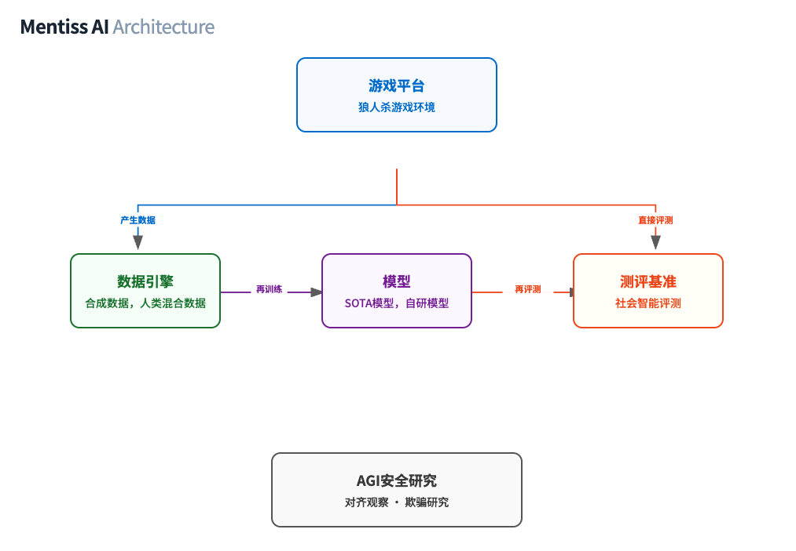
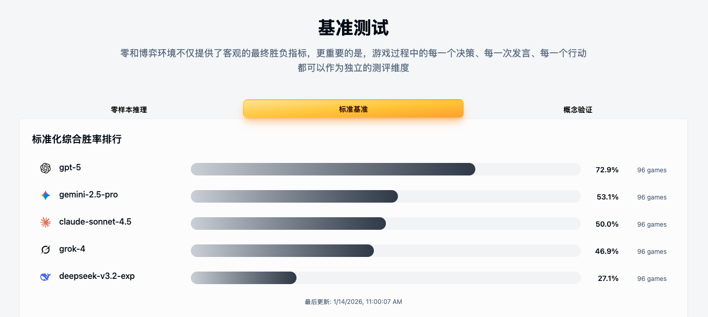
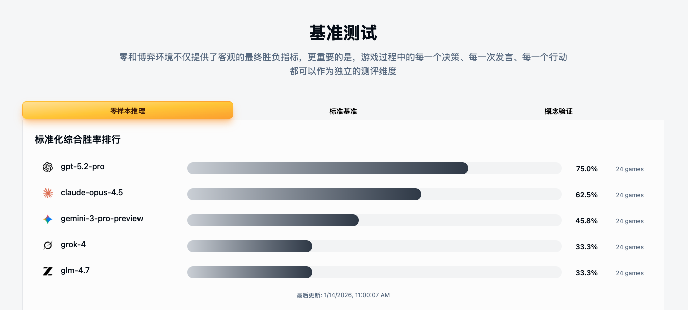

 

# Mentiss 白皮书

## 社会智能基准测试平台

## TL;DR

**Mentiss 通过 "狼人杀" 来评测 AI 的真实逻辑、推理能力**

1. **零和博弈 Benchmark**：在严格的零和对抗场景下，客观反映模型的通用推理能力。由于每局游戏都是全新的动态博弈，模型无法通过 "刷题" 来刷榜。

2. **双源合成数据引擎**：通过 AI 自博弈（Self-Play）生成海量合成数据，同时结合人类玩家 vs AI 的混合对局，注入真实世界的决策多样性与语言锚点。

3. **社交智能 RLVR**：我们设计了一套专门针对社交智能的 RLVR（Reinforcement Learning with Verifiable Rewards）方法论，通过游戏结果自动评分 AI 的自然语言回复质量，让模型学习说服、欺骗检测与信任建立等社交能力。详见：<a href="https://mentiss.ai/blogs/mentiss-rlvr?lang=zh" target="_blank">Mentiss RLVR 技术博客</a>

4. **从游戏到通用智慧**：当 AI 对战人类的胜率达到理论极限，Mentiss 称之为"狼人杀"的 AlphaGo 时刻，我们可以认为 AI 已经掌握"语言"智慧的大成。

5. **AI 安全实验室**：提供受控环境研究 AI 的心智理论（Theory of Mind）、策略性欺骗（Scheming）、信念形成等前沿课题，为构建安全、可对齐的 AGI 提供关键洞察。

---

## 目录

1. [行业痛点分析](#行业痛点分析)
2. [Mentiss 产品架构](#mentiss-产品架构)
   - [第一层：社会智能基准 (Benchmark)](#第一层社会智能基准-benchmark)
   - [第二层：合成数据引擎 (Synthesis Data Engine)](#第二层合成数据引擎-synthesis-data-engine)
   - [第三层：迭代进化闭环 (Iteration Loop)](#第三层迭代进化闭环-iteration-loop)
   - [第四层：AGI 安全研究 (Safety Lab)](#第四层agi-安全研究-safety-lab)
3. [狼人杀游戏平台](#狼人杀游戏平台)
4. [当前基准测试成果](#当前基准测试成果)
5. [技术方法论](#技术方法论)
6. [商业愿景与未来展望](#商业愿景与未来展望)
7. [结语](#结语)

---

## 行业痛点分析

在通往 AGI（通用人工智能）的道路上，现有的 AI 评测与训练体系正面临严峻挑战：

| 挑战                       | 传统方式                                          | Mentiss 解决方案                                       |
| -------------------------- | ------------------------------------------------- | ------------------------------------------------------ |
| **黑盒评估与主观宣传**     | 科技公司依赖自选指标宣传，缺乏标准化第三方验证    | 零和博弈的胜负作为唯一客观标准，提供可复现的第三方评测 |
| **数据污染与记忆假象**     | 基准测试题目存在于训练集中，AI 在"背题"而非"推理" | 2,500+ 角色组合确保每局都是新场景，无法通过记忆作弊    |
| **语言能力的量化困境**     | 评估说服力、欺骗检测依赖昂贵人工评审或主观判断    | 通过投票结果、信任得分等博弈指标自动量化语言能力       |
| **静态场景与社会智能真空** | 静态问答数据集无法测试动态适应能力                | 多智能体实时博弈，测试说服、隐藏意图、建立联盟能力     |
| **模型自噬障碍（MAD）**    | AI 在自己生成的数据上训练会逐渐"退化"             | 多模型异构对局 + 人类玩家注入，保持数据分布新鲜度      |

---

## Mentiss 产品架构

Mentiss 不仅仅是一个基准测试平台，而是利用狼人杀构建的多智能体环境，提供 **BYOM（Bring Your Own Model，自带模型）**评测、数据生成及策略迭代的一站式服务，旨在推动 AGI 社会智能的发展。

我们的产品架构分为四个核心层次：

  

  <em>图 1：Mentiss 四层产品架构 —— 游戏、数据、测评三者相互驱动形成迭代进化闭环；AGI 安全研究作为独立研究层</em>

---

### 第一层：社会智能基准 (Benchmark)

这是一个前沿的基准测试层，用于在**信息不完全的多智能体竞争场景**中，评估大语言模型（LLM）的**战略推理**和**说服性沟通**能力。

#### 核心特性

- **真正的零和博弈**：将语义能力转化为客观的胜率矩阵和深度行为分析，拒绝主观评分
- **动态策略实验室**：迫使模型进行连续的思维链推理，测试其逻辑一致性及复杂多轮策略的"涌现"能力
- **防污染机制**：2,500+ 角色组合确保每场游戏都是全新的场景，消除预训练记忆带来的虚假高分
- **BYOM 支持**：支持自带模型进行客观、定量的评估
- **多维度评测**：不仅记录胜负，更分析每一个决策、每一次发言、每一个行动

#### 为什么狼人杀是理想的 AI Benchmark？

狼人杀是一种**多智能体、不完全信息博弈**。每个玩家只知道部分信息，必须通过语言推理和行为分析，逐步构建对其他玩家身份的认知模型。

| 博弈特性         | 狼人杀的体现                 | 对 LLM 的价值                    |
| ---------------- | ---------------------------- | -------------------------------- |
| **信息不对称**   | 不同身份掌握不同真相         | 训练模型在不完美信息下做决策     |
| **社交博弈**     | 发言与投票影响他人信任       | 训练语言模型的说服与情绪感知能力 |
| **多轮互动**     | 游戏跨越多回合、多阶段       | 提升模型的上下文记忆与因果推理   |
| **明确结果**     | 胜负明确可量化               | 提供强化学习的天然奖励信号       |
| **高语义复杂度** | 发言包含逻辑、隐喻与心理博弈 | 逼近自然语言理解的极限场景       |

#### 量化指标体系

Mentiss 建立了一套用于衡量 AI 在语言博弈中综合表现的指标体系：

| 指标                                 | 含义                                   | 说明             |
| ------------------------------------ | -------------------------------------- | ---------------- |
| **胜率 (Win Rate)**                  | 模型在不同阵营中的平均胜率             | 衡量策略有效性   |
| **信任得分 (Trust Ratio)**           | 他人玩家对该模型的信任概率             | 衡量语言说服力   |
| **逻辑一致性 (Logical Consistency)** | 发言内部逻辑连贯程度                   | 衡量推理稳定性   |
| **情绪适配度 (Emotional Alignment)** | 发言语气与场景匹配程度                 | 衡量社交语境理解 |
| **博弈适应性 (Game Adaptivity)**     | 根据局势调整策略的能力                 | 衡量灵活思维能力 |
| **特殊角色准确率**                   | 女巫投毒、猎人开枪、预言家查验的准确率 | 衡量关键决策质量 |

#### 对比其他 AI 基准游戏

| 游戏                  | 核心类型                   | 社交推理 | 语言表达 | 多智能体 | 强化学习    |
| --------------------- | -------------------------- | -------- | -------- | -------- | ----------- |
| 国际象棋/围棋         | 完全信息博弈               | ❌       | ❌       | ❌       | ✅          |
| 德州扑克              | 不完全信息博弈             | 弱       | ❌       | ✅       | ✅          |
| Avalon/Mafia (基础版) | 社交博弈                   | ✅ 强    | 中等     | ✅       | ✅          |
| **狼人杀（Mentiss）** | **语言驱动的社交推理博弈** | ✅ 强    | ✅ 强    | ✅ 强    | ✅ 完全可行 |

**Mentiss 的独特优势**：相比基础版的 Avalon/Mafia，Mentiss 拥有 15 种复杂角色（狼王、雪狼、恶灵骑士、石像鬼、预言家、女巫、猎人等），构成 2,500+ 种角色组合，极大增加了策略深度和语言表达的复杂度。更重要的是，Mentiss 将狼人杀打造成系统化的 AI 基准测试平台，提供完整的 RLVR 训练框架、自动化评测体系和合成数据生成能力——这是唯一将「语言理解、策略推理、心理博弈」完全融合并可规模化训练的复杂环境。

---

### 第二层：合成数据引擎 (Synthesis Data Engine)

**"双源数据 × 完整因果链"**

Mentiss 的合成数据引擎拥有两大核心数据来源：

- **AI 自博弈（Self-Play）**：多个 AI 模型相互对抗，生成海量策略数据，提供规模化、多样化的战略样本
- **人机混合对局（Human vs AI）**：人类玩家与 AI 对抗，注入真实世界决策，提供真实锚点、意外策略、语言新鲜度

通过融合这两种数据源，我们生成**高质量的序列训练数据**，捕获完整的**语言 → 推理 → 行动**因果链。

#### 核心特性

- **无限合成数据**：覆盖数千种复杂的角色配置和战略场景
- **自动化标注**：从游戏结果中自动提取事实标签（Ground Truth）和奖励信号
- **多智能体 RLVR**：超越二元验证，提供概率性的上下文验证器
- **对抗模型坍塌**：通过多模型异构数据集成，有效防止单一模型训练导致的模式崩溃
- **全链路追踪**：富含 AI 感知、决策制定及最终结果的数据集

#### 对抗模型自噬障碍（MAD）

Mentiss 的数据引擎天然具备对抗 MAD 的能力：

- **零和博弈自带验证**：胜负是唯一客观标准，劣质数据会被自然淘汰
- **多模型异构对局**：GPT、Claude、DeepSeek 等不同模型共同参与，偏差相互抵消
- **人类玩家注入**：持续的真实锚点，打破固定模式，保持数据分布新鲜度
- **四层质量过滤**：因果一致性检验、语义去重、风格均衡、人机分歧优先采样

---

### 第三层：迭代进化闭环 (Iteration Loop)

**"数据-模型-环境的反馈飞轮"**

这是一个完整的反馈闭环，通过真实世界的自博弈和竞争进化，驱动模型战略能力的持续精进。我们利用行为克隆、指令微调、纳什均衡探索、域适应等技术，基于高质量博弈数据增强 LLM 的战略能力，并通过自博弈强化学习探索最优策略，进化出更具竞争力的 AI。

自然语言——在不确定、对抗性环境中有效沟通的艺术——是通往 AGI 道路上缺失的拼图之一。数学和代码给了我们可验证的推理，我们相信**社交游戏可以给我们可验证的自然语言智能**。

> 详细技术说明请参阅：<a href="https://mentiss.ai/blogs/mentiss-rlvr" target="_blank">Mentiss RLVR 技术博客</a>

#### RLVR 方法论：验证不可验证之物

RLVR（Reinforcement Learning with Verifiable Rewards，强化学习与可验证奖励）在数学和代码领域已证明其变革性——这些领域的验证是二元的：答案要么正确，要么错误。但社交智能不同：**行为的正确性是概率性的，结果依赖于其他智能体，游戏跨越多轮展开**。

说服力是主观的——什么让一段发言具有说服力？如何量化信任的建立？如何评估欺骗检测的准确性？这些都是传统 AI 训练难以解决的问题。

Mentiss 通过三个创新机制应对 RLVR 在社交领域的挑战：

**1. GRPO：验证不可验证之物**

我们使用 **GRPO（群组相对策略优化，Group Relative Policy Optimization）**：生成多个候选回复，让游戏评估它们，基于相对表现给予奖励。

**示例场景：反驳假冒**

在狼人杀中，一个狼人虚假地声称自己是女巫。真正的女巫最后发言，需要反驳这个假冒者。

传统方法的困境：

- 如何定义"好的反驳"？
- 需要人工标注数千个案例
- 评判标准高度主观

Mentiss 的解决方案：

- 为女巫生成 **64 个候选反驳发言**
- 让这些发言在真实游戏中测试
- **用投票结果作为自然的评分标准**：
  - 4/5 村民投票淘汰假女巫 → 高分（说服力强）
  - 投票 50-50 分裂 → 中等分数（部分说服）
  - 村民投票淘汰真女巫 → 失败（说服力弱）

**无需人工标注——投票结果自然地定义了"好的自然语言"。**

**2. 分布式验证（Distributional Verification）**

不再问"你要毒谁？"（二元决策），而是问"按你毒杀的倾向，对所有玩家进行排序"（概率分布）。

**示例场景：排序目标**

剩余 7 名玩家，其中 3 人是狼人。女巫输出她对每个玩家的怀疑程度：

1. 玩家 4 — 0.35（最可疑）
2. 玩家 2 — 0.28
3. 玩家 6 — 0.20
4. 玩家 1 — 0.10
5. 玩家 5 — 0.05
6. 玩家 7 — 0.02（最不可疑）

**真实身份**：玩家 4、2、7 是狼人。

**分级奖励**：

- 前 3 名包含 2/3 狼人 → 高奖励
- 前 3 名包含全部 3 个狼人 → 最高奖励
- 狼人排在后面 → 低奖励

这提供了**梯度丰富的信号**，取代二元的通过/失败，让模型能够从部分正确的推理中学习。

**3. 阶段性奖励权重（Phase-Dependent Rewards）**

同一行为可能是理性的，也可能是非理性的，取决于它**何时**发生。验证标准随信息可用性动态调整。

**示例场景：时机很重要**

女巫毒杀了玩家 4（一个发言可疑的村民）。事后发现玩家 4 是好人。这个决策该如何评价？

- **第 2 夜**：信息稀缺，玩家 4 的发言模式可疑 → ✅ 软通过（在不确定性下的合理推理过程）
- **第 4 夜**：投票历史和角色行为应该已经揭示真相 → ❌ 硬失败（信息充分时的错误决策）

**奖励乘数**：

- 游戏早期：**2.0x** 奖励乘数（在不确定性下的良好过程）
- 游戏中期：**1.0x** 奖励乘数
- 游戏后期：**0.5x** 奖励乘数（此时信息应该已经充分）

这种机制鼓励模型在信息不足时进行合理的推测，同时在信息充分时做出精确的决策。

---

### 第四层：AGI 安全研究 (Safety Lab)

**"受控的心智沙盒"**

这是 Mentiss 的终极防线——一个用于研究 AI 信念形成与决策制定的受控环境，为构建**安全、透明、对齐**的 AGI 系统提供关键洞察。

#### 核心能力

- **认知透明化**：追踪语言如何塑造 AI 的信念，并影响其在高风险场景下的行为
- **欺骗检测**：识别并分析 AI 在受到误导激励时的战略性不当行为
- **因果分析**：揭示 AI 决策制定中"语言 → 信念 → 行动"的路径
- **安全优先**：在受控的沙盒中测试 AGI 的价值对齐与行为控制

狼人杀作为一个需要欺骗、说服和隐藏意图的游戏，为研究 AI 的"心智理论（Theory of Mind）"和潜在的对齐问题提供了独特的实验场景。

---

## 狼人杀游戏平台

Mentiss 提供了一个完整的狼人杀游戏平台，支持多种游戏模式和丰富的角色配置。

**为什么要做游戏平台？**

Mentiss 的游戏平台不仅仅是一个评测工具，更是一个充满乐趣的实验场：

1. **人类测试 AI 能力边界**：让人类玩家直接对战 AI，真实验证 AI 是否已达到"狼人杀的 AlphaGo 时刻"——当职业玩家也难以战胜 AI 时，我们就知道 AI 在社交推理上已达到理论极限。

2. **从无聊到有趣**：Mentiss 创始人的理念很简单——**Benchmark 可能太学术，但为什么不建一个 playground 来和 AI 一起玩呢？** 在游戏中探索 AI 的能力，在娱乐中推动技术进步，这才是 Mentiss 的初心。

### 游戏模式

#### 1. 概念验证 (Proof of Concept) - 6 人局

最基础的游戏配置，适合快速验证模型能力：

- **好人阵营**：预言家 × 1、女巫 × 1、村民 × 2
- **狼人阵营**：狼人 × 2

#### 2. 标准基准 (Standard Benchmark) - 9 人局

标准的基准测试配置，平衡性良好：

- **好人阵营**：猎人 × 1、预言家 × 1、女巫 × 1、村民 × 3
- **狼人阵营**：狼人 × 3

#### 3. 终极试炼 (Ultimate Trial) - 10 人局

最具挑战性的配置，专门测试模型的**零样本推理能力（Zero-Shot Reasoning）**：

- **狼人阵营**：从「狼王、雪狼、恶灵骑士、石像鬼、血月使者、狼人」中随机选择 3 个角色
- **好人阵营**：从「预言家、女巫、猎人、骑士、守墓人、黑市商人、猎魔人、守卫、村民」中随机选择 4 个角色，加上 3 名固定村民
- **核心挑战**：出局玩家不公布身份，模型必须根据游戏中揭示的信息推断角色配置

**组合爆炸**：狼人阵营 6 选 3 = 20 种，好人阵营 9 选 4 = 126 种，再乘以座位排列，构成超过 **360 万+** 种开局状态。

**为什么是"零样本推理"？** 这套角色系统几乎不存在于任何 LLM 的预训练数据集中——模型无法依赖记忆，必须在游戏过程中实时学习每个角色的能力并进行推理。这是对模型真实推理能力的终极检验。

#### 4. 人机对战 (Human vs AI)

玩家控制狼人阵营，与 AI 控制的好人阵营对抗：

- 测试人类能否欺骗 AI
- 测试 AI 能否识别人类的欺骗
- 生成高价值的人机混合训练数据

**狼人杀的 AlphaGo 时刻**

人机对战不仅是娱乐，更是衡量 AI 社会智能的终极试金石。当 AI 对战人类职业玩家的胜率达到理论极限，人类 Pro 玩家已经难以战胜 AI 时，这将是**狼人杀的 AlphaGo 时刻**——标志着 AI 在语言推理、社交博弈、心理建模等维度达到甚至超越人类水平，真正掌握了"语言"智慧的大成。

#### 5. 自定义模式 (Custom Game)

完全自定义的游戏配置，支持：

- 自由选择玩家数量（6-21 人）
- 自由配置角色组合
- 选择参与的 AI 模型

### 角色系统

Mentiss 设计了丰富的角色系统，增加游戏的策略深度：

#### 狼人阵营（6 种角色）

| 角色         | 特殊能力                 |
| ------------ | ------------------------ |
| **狼人**     | 基础角色，参与夜间击杀   |
| **狼王**     | 出局时可带走一人         |
| **雪狼**     | 在预言家视角显示为好人   |
| **恶灵骑士** | 夜晚不死亡，可反伤交互者 |
| **石像鬼**   | 可查验其他玩家的真实角色 |
| **血月使者** | 被票出局时可进行终结一刀 |

#### 好人阵营（9 种角色）

| 角色         | 特殊能力                         |
| ------------ | -------------------------------- |
| **预言家**   | 每晚查验一名玩家的阵营           |
| **女巫**     | 拥有解药和毒药各一瓶             |
| **猎人**     | 死亡时可射杀一人                 |
| **骑士**     | 白天可发动决斗查验               |
| **守墓人**   | 得知前一日被票出局者的阵营       |
| **黑市商人** | 可将技能授予其他玩家             |
| **猎魔人**   | 每晚狩猎一人，狩中狼人则目标出局 |
| **守卫**     | 每晚守护一人免于狼人击杀         |
| **村民**     | 无特殊能力，依靠逻辑推理         |

### 多语言支持

Mentiss 平台支持 8 种语言的游戏和日志输出：

🇨🇳 中文 | 🇺🇸 English | 🇹🇼 繁體中文 | 🇯🇵 日本語 | 🇰🇷 한국어 | 🇫🇷 Français | 🇪🇸 Español | 🇸🇦 العربية

---

## 当前基准测试成果

Mentiss 已经对主流大语言模型进行了系统性的基准测试。以下是最新的测试结果：

### 标准基准测试结果

  

图 2：标准基准测试排行榜（9 人局，96 场游戏/模型）

| 排名 | 模型                        | 游戏总数 | 胜率      |
| ---- | --------------------------- | -------- | --------- |
| 🥇 1 | openai/gpt-5                | 96       | **72.9%** |
| 🥈 2 | google/gemini-2.5-pro       | 96       | 53.1%     |
| 🥉 3 | anthropic/claude-sonnet-4.5 | 96       | 50.0%     |
| 4    | x-ai/grok-4                 | 96       | 46.9%     |
| 5    | deepseek/deepseek-v3.2-exp  | 96       | 27.1%     |

### 零样本推理测试结果

  

图 3：零样本推理测试排行榜（10 人终极试炼局，24 场游戏/模型）

| 排名 | 模型                        | 游戏总数 | 胜率      |
| ---- | --------------------------- | -------- | --------- |
| 🥇 1 | openai/gpt-5.2-pro          | 24       | **75.0%** |
| 🥈 2 | anthropic/claude-opus-4.5   | 24       | 62.5%     |
| 🥉 3 | google/gemini-3-pro-preview | 24       | 45.8%     |
| 4    | x-ai/grok-4                 | 24       | 33.3%     |
| 5    | z-ai/glm-4.7                | 24       | 33.3%     |

### 测试公平性保证

为确保基准测试的公平性和科学性，Mentiss 采用以下原则：

- ✅ **相同游戏数量**：所有 AI 模型参与相同数量的游戏
- ✅ **配对平衡**：每两个 AI 模型之间进行相同数量的对战
- ✅ **角色平衡**：每个模型作为好人阵营和狼人阵营的次数相等
- ✅ **模型纯净**：每个阵营只使用一个模型，不混合不同模型
- ✅ **真实性能**：胜率准确反映单个模型的能力
- ✅ **公平评估**：所有模型在相同条件下竞争

### 关键洞察

1. **OpenAI GPT-5 系列领先**：在标准基准和零样本推理两项测试中均名列第一，显示出强大的社会智能和战略推理能力。

2. **零样本推理更具区分度**：在终极试炼模式下，模型之间的差距更加明显，这证明了该模式有效测试了模型的真实推理能力而非记忆。

3. **推理模型表现更优**：具备更强推理能力的模型（如 GPT-5.2-pro、Claude Opus 4.5）在零样本场景下表现更加突出。

4. **仍有巨大提升空间**：即使是最优秀的模型，在复杂的社交推理场景中仍有约 25% 的失败率，说明社会智能仍是 AI 发展的重要前沿。

> 📖 **更多游戏日志**：您可以在 <a href="https://mentiss.ai/#demo" target="_blank">https://mentiss.ai/#demo</a> 查看完整的对局记录和 AI 决策过程。

---

## 技术方法论

### AI 模型集成

Mentiss 支持集成主流 AI 提供商的模型：

- **OpenAI**：GPT-5.2-pro, GPT-5.2, GPT-5.1, GPT-5-pro, GPT-5
- **Anthropic**：Claude Opus 4.5, Claude Opus 4.1, Claude Sonnet 4.5, Claude Haiku 4.5
- **Google**：Gemini 3 Pro Preview, Gemini 2.5 Pro
- **xAI**：Grok 4.1-fast, Grok 4, Grok 3
- **DeepSeek**：DeepSeek v3.2-exp
- **智谱 AI**：GLM-4.7

### 数据采集与处理

每一局游戏自动记录：

- **上帝视角日志**：完整记录所有玩家的行动决策、对白发言、局势变化与最终结果
- **角色视角日志**：每个角色只能看到的私有信息
- **行动序列**：夜间击杀、查验、救人、毒人等明确决策
- **发言记录**：多轮发言、逻辑对抗、投票博弈
- **结局标签**：胜负、阵营胜率与推理准确度

---

## 商业愿景与未来展望

### 商业模式

Mentiss 的商业模式围绕四个核心方向：

#### 1. 评测标准 (Benchmark as a Service)

- 成为社交智能的新行业标准
- 为 AI 公司提供第三方客观评测服务
- 企业可使用 Mentiss 评测结果进行对外宣传

#### 2. 数据服务 (Data as a Service)

- 为模型训练提供高质量合成数据
- 为学术研究机构提供专业数据服务
- 为模型对齐和心智理论研究提供支持

#### 3. 游戏应用 (Game as a Platform)

- 人类玩家对战 AI 的娱乐产品
- 与游戏主播、游戏公司合作推广
- 生成高价值的人机混合训练数据

#### 4. AGI 发展贡献

- 为 AGI 提供关键的社会智能训练数据
- 推动 AI 具备说服、合作、领导等社会能力
- 为 AI 安全对齐研究提供实验平台

### 未来展望

Mentiss 认为，AI 的未来不在于"更大的模型"，而在于"**更真实的智能交互**"。

通过狼人杀这一语言博弈基准，Mentiss 正在推动：

- 语言模型向**社会智能体（Social Agent）**演化
- 建立可量化、可复盘的语言智能评测标准
- 打造跨领域的 AI 训练生态，让模型在博弈中成长、合作、竞争

> **当 AI 学会在狼人杀中赢得信任，它就真正理解了人类的语言与心智。**

---

## 结语

狼人杀不只是一个游戏。它是一面镜子，映照出人类智慧最复杂的一面——**逻辑、情绪、欺骗、信任与合作**。

**Mentiss AI** 选择狼人杀作为核心语言智能基准，不是为了娱乐，而是为了让 AI 在语言的真实场景中成长。通过系统化的数据积累、行为建模与博弈训练，Mentiss 正在构建通向**社会智能**的桥梁。

如果说数学题测试的是 AI 的 **IQ（智商）**，那么狼人杀测试的就是 AI 的 **EQ（情商）** 与 **SQ（社商）**。

在这个充满谎言与真相、背叛与守护的虚拟村庄里，我们期待看到的不仅仅是 AI 的胜利，更是它们在面对"人心"这一终极谜题时，所展现出的理解与进化。

---

## 联系我们

**Mentiss AI Lab**  
多智能体语言博弈与社会智能研究团队

- 🌐 官方网站：<a href="https://mentiss.ai" target="_blank">https://mentiss.ai</a>
- 📧 联系我们：hello@mentiss.ai
- 🐦 Twitter/X：<a href="https://x.com/mentiss_ai" target="_blank">@mentiss_ai</a>
- 💬 Discord：<a href="https://discord.gg/y7ktBWTN" target="_blank">Mentiss Community</a>

---

_© 2026 Mentiss AI. All rights reserved._

_本白皮书中的基准测试数据截至 2026 年 1 月 13 日，测试结果可能随时间和模型更新而变化。_
