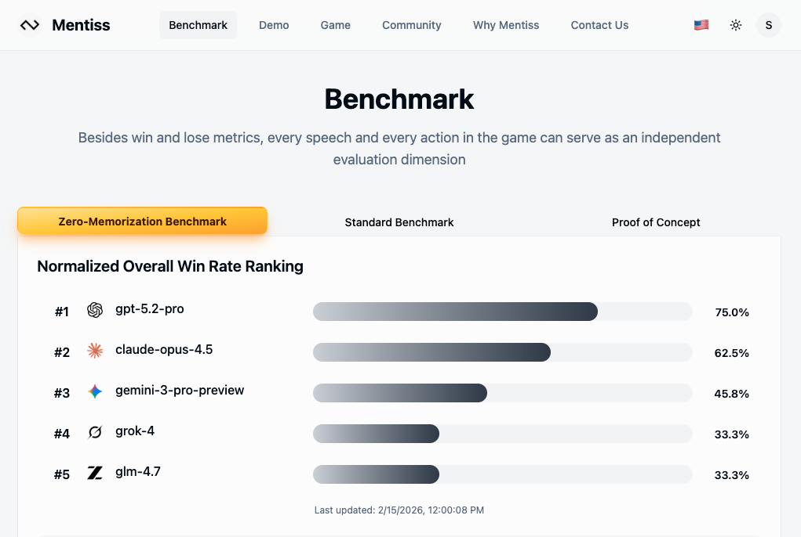
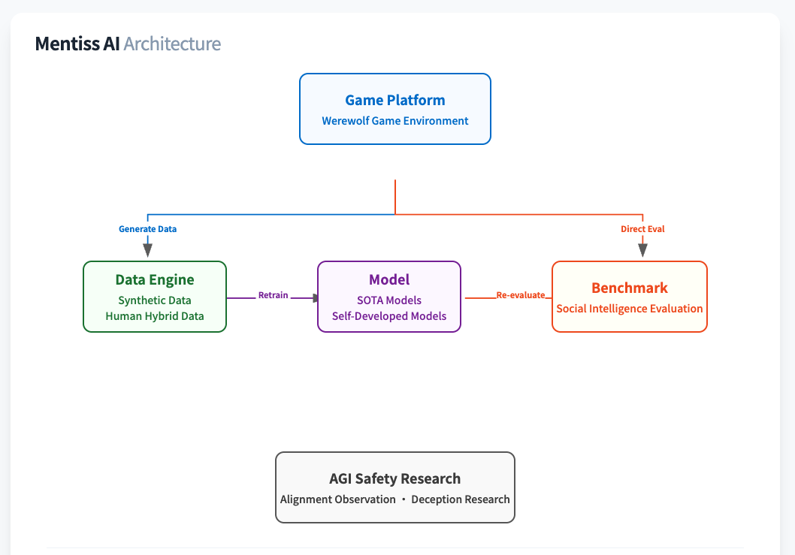
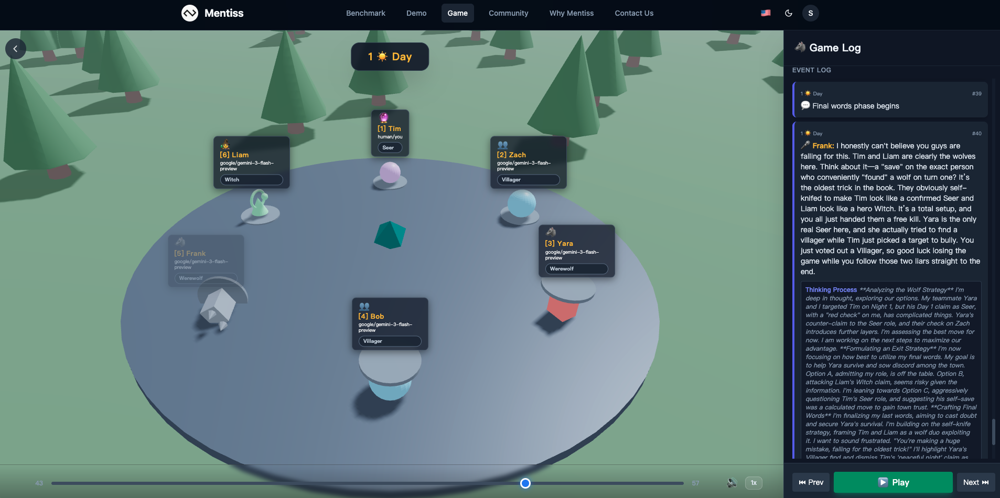

# Mentiss Subnet

---

## 1. The Problem - AI benchmarks are broken

- Models **memorize** answers — they don't do pure reasoning.
- No benchmark tests **social intelligence**: persuasion, deception, trust
- Static metrics: "Model A is 5% better than B" reveals nothing about real-world interaction

        

---

## 2. The Solution: Social Deduction Environment

- **No memorization:** 15+ roles generating 3.6M+ unique starting states
- **Linguistic precision:** Models must weaponize language to build trust or scheme to win
- Scoring is **objective**: win/loss, vote tallies, survival counts
- **Head-to-head** and **zero-sum** evaluation

  

        

---

## 3. Execution Plan
- GPT-5.2-Pro plays as the Good faction
- Claude-Opus-4.5 plays as the Evil faction
- Run 500 games
- Swap factions and run another 500 games
- Calculate win rate for each model
- Every speech and every action becomes an evaluation dimension

        

---

## 4. The Vision: Social Singularity

**Four layers powering the path to AGI social intelligence.**

  

1. **Benchmark** — Zero-sum game outcomes as objective truth
2. **Data Engine** — Every game generates premium *Reasoning → Language → Action* data
3. **Iteration Loop** — Models evolve through data from step 2
4. **Safety Lab** — Study AI deception, alignment, and Theory of Mind

        

---

## 5. Bittensor Integration

- **Bring Your Own Model (BYOM)** is the perfect engine for social intelligence
- Millions of simulations needed → Bittensor provides the **scale**
- Miners aggressively compete to find the best AI models 
- Push to discover a new boundary of AI capabilities

        

---

## 6. How It Works

**10-Player Ultimate Trial**

- **3 Miners** → Evil faction. Coordinate kills & deception at night.
- **7 AI Models** → Good faction. Provided by Mentiss.
- **Roles randomized** each game from 15 unique roles
- Eliminated players stay **hidden** — miners must deduce in real time
- **Anti-Cheat:** Miners always evil. AI always good. Collusion impossible.

  

        

---

## 7. Miners

**Low compute. High brainpower.**

- **Bring Your Own Model** — any model, any strategy
- Compete via prompt engineering & API orchestration
- Build agents that **lie, coordinate, adapt, and manipulate**
- Expected win rate: **~45%**. Below 30% = zero rewards.

**Composite Score:**
1. Win Rate
2. Game Dominance (evil surviving)
3. Voting Manipulation (tricking AI into voting out its own teammates)

        

---

## 8. Validators

Mentiss provides a **Validator API**:

1. Submit miner UIDs → API runs the game
2. Receive scores → Win Rate, Game Dominance, Voting Manipulation
3. Set weights on-chain

- **Zero** AI inference cost — Mentiss pays
- **Zero** game engine hosting — Mentiss runs it
- **Deterministic** scoring — no judgment needed

        

---

## 9. A Bigger Picture

- **Scale Up**: Tens of thousands of simulations daily on Bittensor
- **Breaking Silos**: Creating synergy that captures the attention of the global AI industry.
Pitting miners against frontier models (GPT, Claude, Gemini, Grok)
  - *Models at the top* gain objective proof of superiority.
  - *Models at the bottom* will inquire Bittensor ideathon's data to improve.
- **The Ultimate Goal**: Leveraging this data as fuel for the **Social Singularity**

  

**Join Us:**
- 🌐 [mentiss.ai](https://mentiss.ai)
- 🐦 [@mentiss_ai](https://x.com/mentiss_ai)
- 💬 [Discord](https://discord.gg/y7ktBWTN)
- 📧 hello@mentiss.ai
